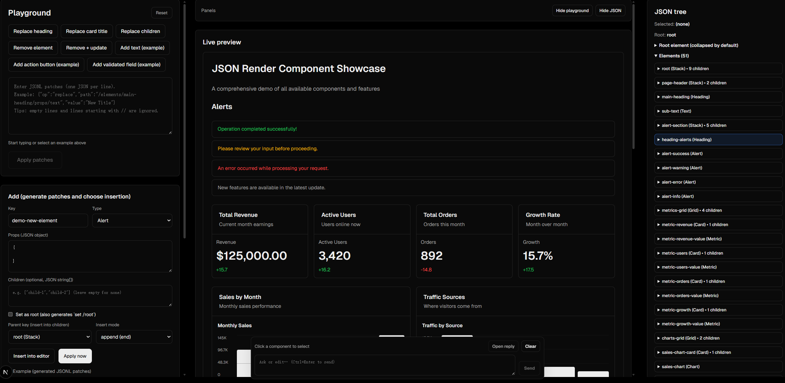
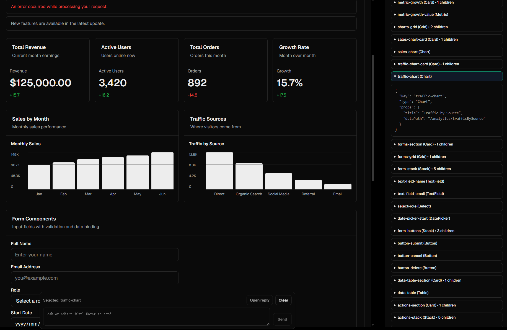
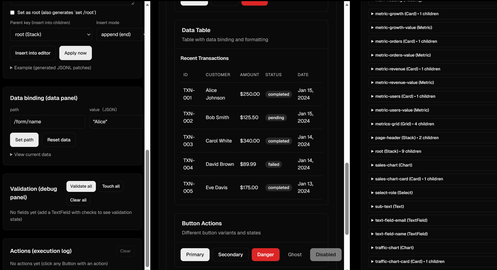
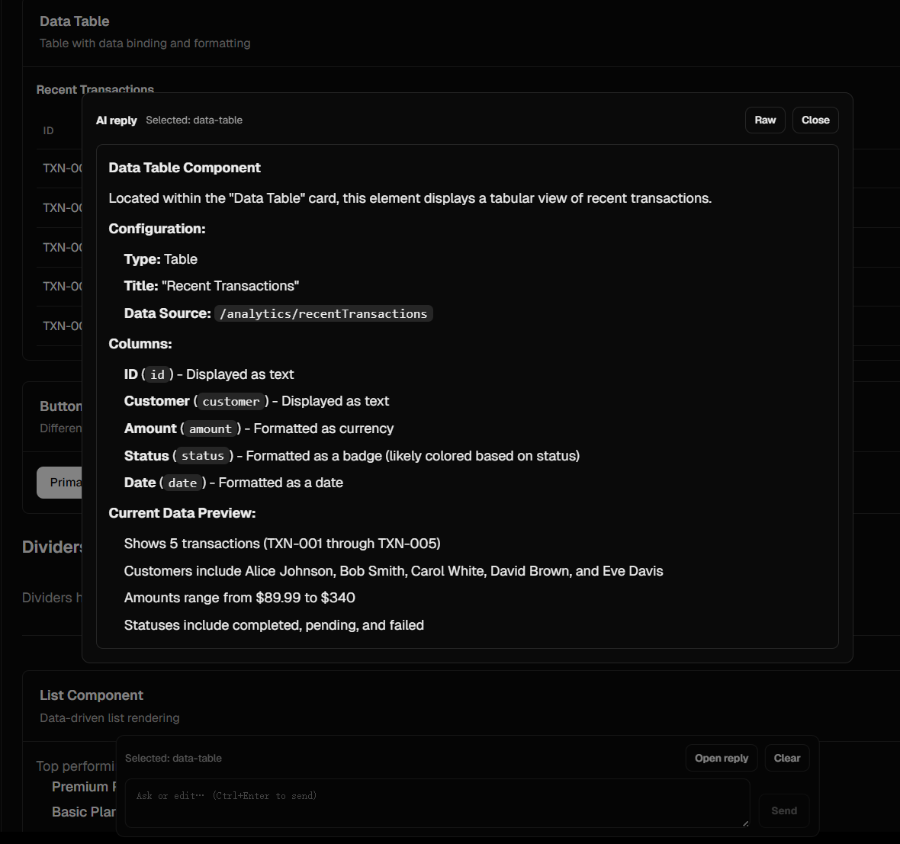

## nextjs-json-render

**English | [中文](README-zh.md)**

Interactive playground for learning **json-render** in a real Next.js app.

**json-render**: [https://github.com/vercel-labs/json-render](https://github.com/vercel-labs/json-render)

This repo focuses on the core concepts you’ll use in json-render projects:
- **UI Tree** (`UITree`): `root` + flat `elements` map
- **Components registry**: map `type -> React component`
- **JSONL patches**: mutate the tree with `set/add/replace/remove`
- **Data binding**: read/write via JSON Pointer paths (e.g. `/form/email`)
- **Validation**: field checks + validation state debugging
- **Actions**: named actions handled by your app, with execution logging

Learning-friendly extras:
- **Hover-to-locate JSON**: hover a component in Live preview → highlights the matching element in the JSON tree
- **Tree order matches render**: JSON tree lists elements in UI traversal order (root → children)
- **List/Chart defaults**: demo data renders out-of-the-box (no extra item templates required)
- **Chat-based UI editing**: click an element to select → ask the agent to edit/add/remove → JSON patch lines apply live; reply renders in a Markdown modal (with Raw stream view)

## Why json-render?

When you want an AI agent to help build or edit UI, you usually need two things at the same time:
- **Creativity** (the model proposes layouts and components)
- **Control** (your app stays safe, predictable, and debuggable)

json-render gives you that control by turning your UI into a serializable `UITree` and letting the agent mutate it through **JSONL patches**. The agent can “see” the current UI tree and “operate” on it, while you keep the guardrails: a predefined component registry, data bindings, and named actions implemented by your app.

## Relationship to Google A2UI

This project space is often described as **“AI → JSON → UI”**. Google’s **A2UI** and `vercel-labs/json-render` overlap conceptually, but they emphasize different goals:
- **A2UI** is **protocol-first**: standardized streaming messages, cross-framework portability.
- **json-render** is **developer-first**: flexibility in your contracts and tight integration with your stack.

The json-render maintainers also clarified that json-render’s JSON format is primarily a **library API**, not a protocol intended to become a universal standard, while still being open to interoperability where it’s valuable.

Reference Q&A: `https://github.com/vercel-labs/json-render/issues/9`

## Project origin

This playground is adapted from the upstream dashboard example:
`https://github.com/vercel-labs/json-render/tree/main/examples/dashboard`

---

## Quick Start

```bash
bun install
bun run dev
```

Open `http://localhost:3000`.

### AI Chat (optional)

The chat editor calls `src/app/api/generate/route.ts` and requires `GLM_API_KEY`.

Create `.env.local`:
```bash
GLM_API_KEY=...
```

### Choosing an AI provider/model

The API route uses the Vercel AI SDK, so you can swap model providers as needed.

Provider guide: `https://ai-sdk.dev/docs/getting-started/choosing-a-provider`

---

## How the Playground Works

The UI is a 3-column layout:
- **Left**: patch editor + “Add” builder + learning panels (Data/Validation/Actions)
- **Middle**: **Live preview** (renders the current tree)
- **Right**: **JSON tree viewer** (elements collapsed by default)

Use the panel buttons above **Live preview** to **hide/show** the Playground or JSON panel.

### Chat-based UI editing

1. Click a component in **Live preview** (or in the JSON tree list) to select it.
2. Use the fixed bottom-center chat input to ask for edits (Ctrl/⌘ + Enter to send).
3. The agent reply opens in a modal (Markdown). Any standalone JSON patch lines are applied to the current `UITree` as they stream.

---

## Screenshots

**1) Full UI overview (Playground + Live preview + JSON tree + Chat)**



**2) Preview ↔ JSON tree mapping (expanded element)**



**3) Playground ↔ Data binding ↔ Preview**



**4) Chat reply modal (describe selected Table)**



---

## JSONL Patches (Supported Ops)

The editor accepts **JSON Lines** (one JSON object per line).
- Empty lines and lines starting with `//` are ignored.
- Supported ops: `set`, `add`, `replace`, `remove`

Paths you’ll commonly use:
- `/root` (string) — sets the root element key
- `/elements/{key}` — adds/replaces a whole element
- `/elements/{key}/props/...` — updates a nested prop
- `/elements/{key}/children` — replaces the children array (recommended)

Example: replace a heading
```json
{"op":"replace","path":"/elements/main-heading/props/text","value":"Hello from patches!"}
```

Example: add a `Text` element and append it to `root.children`
```json
{"op":"add","path":"/elements/demo-text","value":{"key":"demo-text","type":"Text","props":{"content":"(Added) This is a new Text element","variant":"muted"},"parentKey":"root"}}
{"op":"replace","path":"/elements/root/children","value":["page-header","alert-section","metrics-grid","charts-grid","forms-section","data-table-section","actions-section","divider-demo","list-demo","demo-text"]}
```

Notes:
- `remove` removes an element key (and in this demo also removes its descendants + cleans up dangling references).
- When removing an element referenced by a parent, you generally also patch the parent `children` (or use the demo’s subtree-remove behavior).

---

## Actions

Buttons can declare actions by name (and optional params):
```json
{
  "type": "Button",
  "props": {
    "label": "Export (JSON)",
    "variant": "secondary",
    "action": { "name": "exportData", "params": { "format": "json" } }
  }
}
```

Actions are handled by app code (`src/lib/mockData.ts`), and the Playground logs:
- action name
- params
- status (running/success/error)

Try it:
1. Click **Add action button (example)** in the Playground.
2. Click the new button in the UI.
3. Check the **Actions (execution log)** panel.

---

## Data Binding + Validation

Components like `TextField`, `Select`, and `DatePicker` bind to data using JSON Pointer paths (e.g. `/form/email`).

The Playground includes:
- **Data panel**: set any path/value to see live updates
- **Validation panel**: view field validation state and run `Validate all`

Try it:
1. Use the Data panel to set `/form/email` to `"bad-email"`.
2. Focus/blur the email field (or use **Validate all**).
3. See validation errors in the UI + the Validation panel.

Notes:
- **Touch** marks “user interacted”; **Validate** runs checks and produces errors. So “Touch all” may only flip `touched=true`.
- This app uses an **app-side validation provider** (`src/lib/validation.tsx`) to correctly validate nested JSON Pointer paths like `/form/email`.

---

## List / Chart Data Shapes

- **List** (`src/components/ui/list.tsx`): renders arrays from `dataPath`; `{name,value}` shows as “name — value”, other objects fall back to JSON.
- **Chart** (`src/components/ui/chart.tsx`): supports `{label,value}` and common demo shapes like `{month,sales}` and `{source,visitors}`; you can also pass `labelKey/valueKey`.

---

## Repo Pointers

- UI page: `src/app/page.tsx`
- Component registry: `src/components/ui/index.ts`
- Patch utilities + examples: `src/lib/patchUtils.ts`
- Demo initial tree: `src/lib/mockPatches.ts`
- Demo data/actions: `src/lib/mockData.ts`
- Validation provider (app-side): `src/lib/validation.tsx`
- Troubleshooting notes: `docs/troubleshooting-nextjs-hydration-and-update-depth.md`
